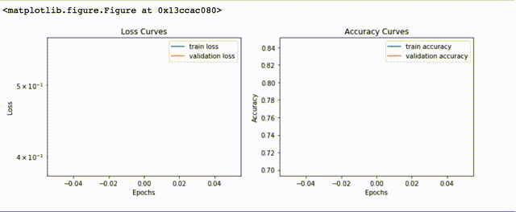

## Predict The Attributes of the Animal using Deep Learning

This project is about predicting attributes of animals given an image. It was part of [hackerearth.com Challenge](https://www.hackerearth.com/challenge/competitive/deep-learning-3/), where 18.000 images where provided. Some of the pictures have labels with characteristics and some not; the goal is to create a solution that predicts those attributes.

Given an animal image like below:


The final solution use Progressive Neural Architecture Search (PNASNet-5) to extract bottle neck features. The model has 98.3% of accuracy.



The features were extracted using `retrain.py` script that can be found in TensorFlow Hub repository
and th command to extract features is as follows 

```
python retrain.py \
    --image_dir ./DL3Dataset \
    --tfhub_module https://tfhub.dev/google/imagenet/pnasnet_large/feature_vector/1
```
